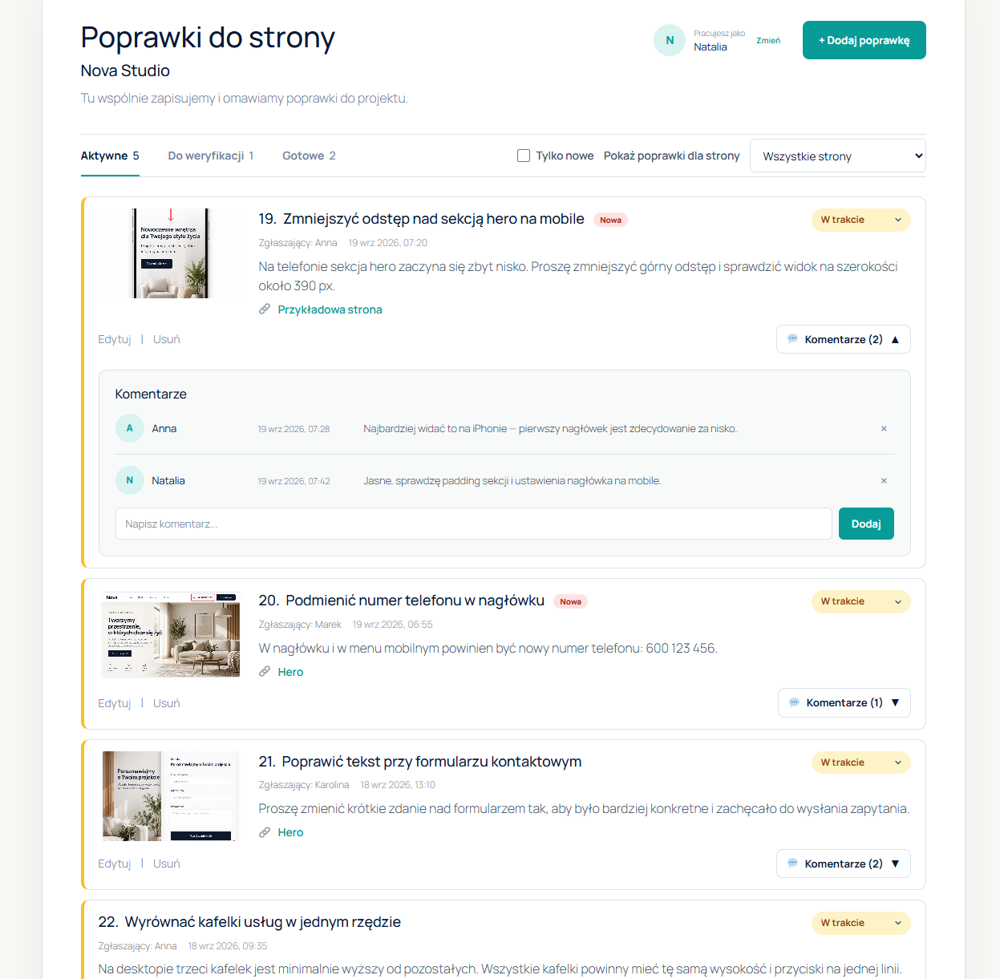

# Corrections Manager

Wtyczka WordPress do zgłaszania i zarządzania poprawkami bezpośrednio na stronie testowej lub developerskiej.

Interfejs został zbudowany w Vue 3 i Vite, natomiast poprawki, komentarze oraz informacje o edycji są przechowywane w bazie danych WordPressa.

## Dashboard



---

# Polski

## Funkcje

- dodawanie poprawek do strony,
- przypisywanie poprawek do istniejących stron WordPressa,
- dodawanie zrzutów ekranu i obrazów,
- edycja i usuwanie poprawek,
- dodawanie i usuwanie komentarzy,
- statusy poprawek:
  - W trakcie,
  - Do weryfikacji,
  - Gotowe,
- oznaczenie nowych poprawek badge'em „Nowa”,
- filtrowanie poprawek według strony,
- automatyczne odświeżanie listy poprawek,
- zabezpieczenie przed nadpisaniem zmian wykonanych przez inną osobę,
- informacja, gdy inna osoba edytuje tę samą poprawkę,
- automatyczne użycie nazwy zalogowanego użytkownika WordPress,
- możliwość ręcznego wpisania imienia przez niezalogowanego użytkownika,
- zapisywanie obrazów w Bibliotece mediów WordPressa,
- link do listy poprawek w panelu WordPressa,
- automatyczne usuwanie danych po odinstalowaniu wtyczki.

## Wymagania

- WordPress 6.5+
- PHP 7.4+
- Node.js 22.18+ lub 24.12+ — tylko do developmentu

Node.js i npm nie są potrzebne na stronie produkcyjnej lub testowej, jeśli katalog `build` został wcześniej wygenerowany i znajduje się we wtyczce.

## Instalacja

Umieść wtyczkę w:

```text
wp-content/plugins/corrections-manager
```

Zainstaluj zależności:

```bash
npm install
```

Zbuduj aplikację Vue:

```bash
npm run build
```

Następnie aktywuj **Corrections Manager** w panelu WordPressa.

Utwórz lub edytuj stronę WordPress i dodaj shortcode:

```text
[corrections_manager]
```

Opublikuj stronę.

## Lista poprawek w panelu WordPressa

Po utworzeniu opublikowanej strony zawierającej shortcode administrator może przejść do:

```text
Ustawienia → Lista poprawek
```

W tym miejscu znajduje się bezpośredni link do panelu poprawek.

Wtyczka automatycznie wyszukuje opublikowaną stronę zawierającą:

```text
[corrections_manager]
```

Dzięki temu zmiana adresu lub sluga strony nie wymaga aktualizowania ustawień wtyczki.

## Development

Uruchomienie Vite:

```bash
npm run dev
```

Sprawdzenie kodu JavaScript i Vue:

```bash
npm run lint
```

Generowanie wersji produkcyjnej:

```bash
npm run build
```

Formatowanie kodu:

```bash
npm run format
```

## Przechowywanie danych

Poprawki i komentarze są przechowywane w osobnych tabelach bazy danych WordPressa z wykorzystaniem aktualnego prefiksu tabel.

Obrazy dodawane do poprawek są zapisywane w Bibliotece mediów WordPressa.

Każdy obraz przesłany przez Corrections Manager otrzymuje dodatkowe meta:

```text
_corrections_manager_upload
```

Dzięki temu wtyczka może odróżnić własne obrazy od pozostałych plików w Bibliotece mediów.

## Usuwanie obrazów

Obrazy dodane przez Corrections Manager są automatycznie usuwane, gdy:

- obraz zostanie zastąpiony nowym,
- obraz zostanie usunięty z poprawki,
- poprawka zostanie usunięta,
- zapis poprawki nie powiedzie się po wcześniejszym przesłaniu obrazu,
- wtyczka zostanie odinstalowana.

## Odinstalowanie

Usunięcie wtyczki z poziomu WordPressa powoduje trwałe usunięcie:

- wszystkich poprawek,
- komentarzy,
- tabel bazy danych Corrections Manager,
- obrazów przesłanych przez Corrections Manager,
- opcji zapisanych przez wtyczkę.

Operacji nie można cofnąć.

## REST API

Aplikacja Vue komunikuje się z WordPressem przez własne endpointy REST API:

```text
/wp-json/corrections-manager/v1/
```

Operacje modyfikujące dane są zabezpieczone nonce WordPress REST API.

Operacje PATCH i DELETE wykonywane przez frontend korzystają z żądań POST oraz:

```text
X-HTTP-Method-Override
```

Zapewnia to lepszą kompatybilność z hostingami, firewallami i wtyczkami bezpieczeństwa.

## Fonty

Font Manrope jest przechowywany lokalnie przy użyciu:

```text
@fontsource/manrope
```

Wtyczka nie wymaga połączenia z Google Fonts.

## Przeznaczenie

Corrections Manager został zaprojektowany głównie do pracy na stronach testowych i developerskich.

Pozwala klientowi lub członkom zespołu zgłaszać poprawki bez konieczności korzystania z panelu administracyjnego WordPressa.

Jeżeli strona testowa jest dostępna publicznie, w razie potrzeby dostęp do całego środowiska stagingowego powinien zostać zabezpieczony osobno.

---

# English

## Features

- add website corrections,
- assign corrections to existing WordPress pages,
- attach screenshots and images,
- edit and delete corrections,
- add and delete comments,
- correction statuses:
  - In progress,
  - Review,
  - Ready,
- "New" badge for newly submitted corrections,
- filter corrections by page,
- automatic correction list refresh,
- protection against overwriting changes made by another user,
- indication when another person is editing the same correction,
- automatic use of the logged-in WordPress user's display name,
- manual name entry for visitors,
- correction images stored in the WordPress Media Library,
- direct corrections list link in the WordPress admin panel,
- automatic data cleanup when the plugin is uninstalled.

## Requirements

- WordPress 6.5+
- PHP 7.4+
- Node.js 22.18+ or 24.12+ for development only

Node.js and npm are not required on the staging or production website when the compiled `build` directory is included with the plugin.

## Installation

Place the plugin in:

```text
wp-content/plugins/corrections-manager
```

Install dependencies:

```bash
npm install
```

Build the Vue application:

```bash
npm run build
```

Activate **Corrections Manager** in the WordPress admin panel.

Create or edit a WordPress page and add:

```text
[corrections_manager]
```

Publish the page.

## Corrections list in WordPress

After creating a published page containing the shortcode, administrators can go to:

```text
Settings → Lista poprawek
```

This page contains a direct link to the Corrections Manager interface.

The plugin automatically finds the published page containing:

```text
[corrections_manager]
```

Changing the page slug or URL therefore does not require updating the plugin settings.

## Development

Start Vite:

```bash
npm run dev
```

Run JavaScript and Vue linting:

```bash
npm run lint
```

Create a production build:

```bash
npm run build
```

Format source files:

```bash
npm run format
```

## Data storage

Corrections and comments are stored in custom WordPress database tables using the current WordPress table prefix.

Correction images are uploaded to the WordPress Media Library.

Each image uploaded by Corrections Manager receives the following metadata:

```text
_corrections_manager_upload
```

This allows the plugin to distinguish its own uploads from other Media Library files.

## Image cleanup

Images created by Corrections Manager are automatically removed when:

- an attached image is replaced,
- an image is removed from a correction,
- a correction containing the image is deleted,
- saving a correction fails after an image upload,
- the plugin is uninstalled.

## Uninstall

Deleting the plugin through WordPress permanently removes:

- corrections,
- comments,
- Corrections Manager database tables,
- images uploaded by Corrections Manager,
- plugin database options.

This operation cannot be undone.

## REST API

The Vue application communicates with WordPress through custom REST API endpoints:

```text
/wp-json/corrections-manager/v1/
```

Write operations use a WordPress REST API nonce.

PATCH and DELETE operations from the frontend use POST requests with:

```text
X-HTTP-Method-Override
```

This provides better compatibility with hosting environments, firewalls and security plugins.

## Fonts

Manrope is bundled locally using:

```text
@fontsource/manrope
```

The plugin does not require a Google Fonts connection.

## Intended use

Corrections Manager is primarily designed for staging and development websites.

It allows clients and team members to submit website corrections without using the WordPress administration panel.

If the staging website is publicly accessible, access to the staging environment should be protected separately when required.
